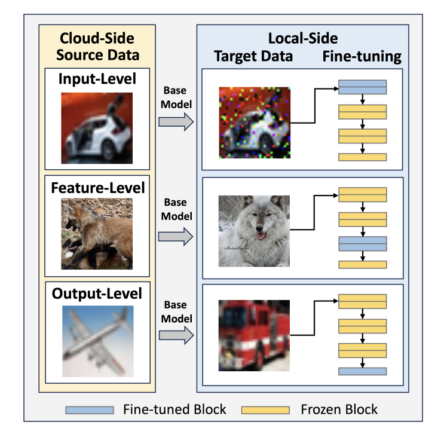
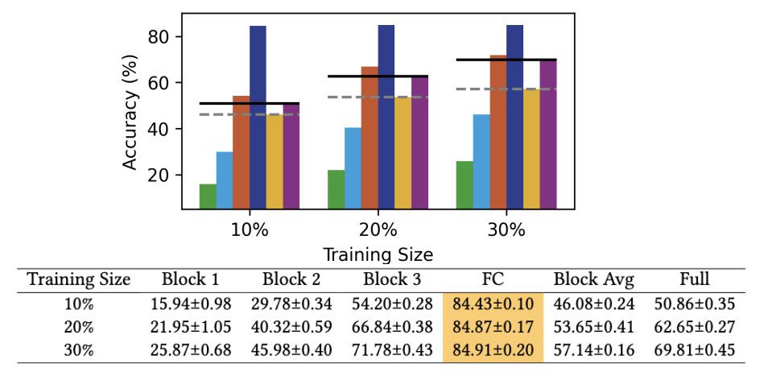
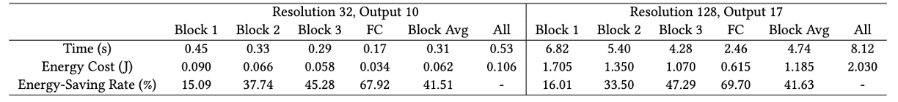

<div align="center">
  <h1>Towards Low-Energy Adaptive Personalization for Resource-Constrained Devices</h1>
</div>


<p align="center">
  <strong><a href="https://arxiv.org/abs/2403.15905">[Paper]</a></strong>
  <strong><a href="https://netsys.doc.ic.ac.uk/">[Team]</a></strong>
</p>

Accepted to *[The 4th Workshop on Machine Learning and Systems (EuroMLSys '24), co-located with EuroSys '24](https://euromlsys.eu/).*


## Introduction 
The personalization of machine learning (ML) models to address data drift is a significant challenge in the context of Internet of Things (IoT) applications. Presently, most approaches focus on fine-tuning either the full base model or its last few layers to adapt to new data, while often neglecting energy costs. However, various types of data drift exist, and fine-tuning the full base model or the last few layers may not result in optimal performance in certain scenarios. We propose Target Block Fine-Tuning (TBFT), a low-energy adaptive personalization framework designed for resource-constrained devices. We categorize data drift and personalization into three types: input-level, feature-level, and output-level. For each type, we fine-tune different blocks of the model to achieve optimal performance with reduced energy costs. Specifically, input-, feature-, and output-level correspond to fine-tuning the front, middle, and rear blocks of the model. We evaluate TBFT on a ResNet model, three datasets, three different training sizes, and a Raspberry Pi. Compared with the $Block Avg$, where each block is fine-tuned individually and their performance improvements are averaged, TBFT exhibits an improvement in model accuracy by an average of 15.30\% whilst saving 41.57\% energy consumption on average compared with full fine-tuning.

<div align="center">
 
</div>

<div align="center">
  <h5>System Overview</h5>
</div>

## 1. Requirements
To get started and download all dependencies, run:

```
pip install -r requirements.txt 
```

In addition, please prepare the two datasets:

[Cifar10-C](https://github.com/RobustBench/robustbench) [1]. 

[Living17](https://github.com/MadryLab/BREEDS-Benchmarks) [2].

## 2. Motivation Experiments

Fine-tuning accuracy results on noised blocks. The bset block-based accuracy is highlighted.

<div align="center">
 
</div>

The code is in `./motivation_exp`.

(1) Train the original model, shown as `./motivation_exp/train_origin_resnet.py`. We also release the model utilised in our paper, please refer to `./motivation_exp/resnet26_model.pth`.

(2) Add noise and finetune, shown as `./motivation_exp/add_noise_resnet.py`.

## 2. Main Experiments

### 2.1 Cifar10-C

The experimental results for the Cifar10-C dataset.

<div align="center">
 
</div>

The original model here is same with the original model in Motivation Experiments (trained on Cifar10).

To run, use `python ./exp_cifar10c.py` with appropriate model and parameters (see `exp_cifar10c.py` 113-123 for defaults).

### 2.2 Living17

The experimental results for the Living17 dataset.

<div align="center">
 
</div>

The code is in `./main_exp/Living17`.

(1) Train the original model, shown as `./main_exp/Living17/Living17_ResNet26_origin.py`. We also release the model for Living17 dataset utilised in our paper, please refer to `./main_exp/Living17/ResNet26_origin_Living17.pth`.

(2) Add noise and finetune, shown as `./main_exp/Living17/Living17_ResNet26_finetune.py`.

### 2.3 Cifar-Flip

The experimental results for the Cifar-Flip dataset.

<div align="center">
 
</div>

The original model here is same with the original model in Motivation Experiments (trained on Cifar10).

To run, use `python ./exp_cifar10flip.py` with the appropriate model and parameters (see `exp_cifar10flip.py` 101-111 for defaults).

### 2.4 System Cost

The time and energy costs of block-based and full model fine-tuning. The Energy-SavingRate is calculated by comparing the current energy cost to the energy cost of full model fine-tuning.

<div align="center">
 
</div>

For the System Cost, please refer to the paper for further details.


## Citation

If you found our work useful please consider citing it:

```bibtex
@misc{huang2024lowenergy,
      title={Towards Low-Energy Adaptive Personalization for Resource-Constrained Devices}, 
      author={Yushan Huang and Josh Millar and Yuxuan Long and Yuchen Zhao and Hamed Hadaddi},
      year={2024},
      eprint={2403.15905},
      archivePrefix={arXiv},
      primaryClass={cs.LG}
}
```

## Acknowledgments

Our paper and code partially reference Robustbench [1], Breeds [2], Surgical Fine-Tuning [3], and MEMO [4]. We would like to express our gratitude for their open-sourcing of the codebase, which served as the foundation for our work.


## References

[1] Croce, F., Andriushchenko, M., Sehwag, V., Debenedetti, E., Flammarion, N., Chiang, M., Mittal, P. and Hein, M., 2020. Robustbench: a standardized adversarial robustness benchmark. arXiv preprint arXiv:2010.09670.

[2] Santurkar, S., Tsipras, D. and Madry, A., 2020. Breeds: Benchmarks for subpopulation shift. arXiv preprint arXiv:2008.04859.

[3] Lee, Y., Chen, A.S., Tajwar, F., Kumar, A., Yao, H., Liang, P. and Finn, C., 2022, September. Surgical Fine-Tuning Improves Adaptation to Distribution Shifts. In The Eleventh International Conference on Learning Representations.

[4] Zhang, M., Levine, S. and Finn, C., 2022. Memo: Test time robustness via adaptation and augmentation. Advances in neural information processing systems, 35, pp.38629-38642.


