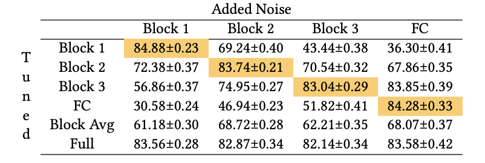
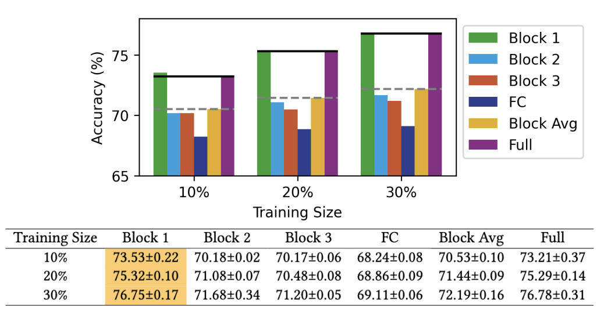
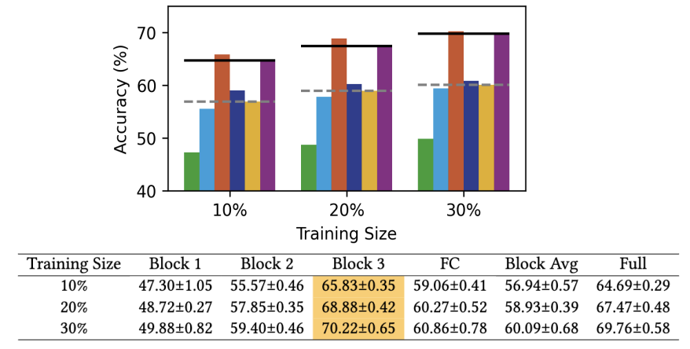

# Towards Low-Energy Adaptive Personalization for Resource-Constrained Devices
This repository includes the code required to reproduce the experiments and figures in the paper:

Yushan Huang, Josh Millar, Yuxuan Long, Yuchen Zhao, Hamed Haddadi. "Towards Low-Energy Adaptive Personalization for Resource-Constrained Devices." Accepted to *[The 4th Workshop on Machine Learning and Systems (EuroMLSys '24), co-located with EuroSys '24](https://euromlsys.eu/).* [Paper]().

## 1. Requirements
To get started and download all dependencies, run:

```
pip install -r requirements.txt 
```

In addition, please prepare the two datasets:

[Cifar10-C](https://github.com/RobustBench/robustbench) [1]. 

[Living17](https://github.com/MadryLab/BREEDS-Benchmarks) [2].

## 2. Motivation Experiments

Fine-tuning accuracy results on noised blocks. The bset block-based accuracy is highlighted.

 

The code is in `./motivation_exp`.

(1) Train the original model, shown as `./motivation_exp/train_origin_resnet.py`. We also release the model utilised in our paper, please refer to `./motivation_exp/resnet26_model.pth`.

(2) Add noise and finetune, shown as `./motivation_exp/add_noise_resnet.py`.

## 2. Motivation Experiments

### 2.1 Cifar10-C

The experimental results for the Cifar10-C dataset.

 


### 2.2 Living17

The experimental results for the Living17 dataset.

 

The code is in `./main_exp/Living17`.

(1) Train the original model, shown as `./main_exp/Living17/Living17_ResNet26_origin.py`. We also release the model for Living17 dataset utilised in our paper, please refer to `./main_exp/Living17/ResNet26_origin_Living17.pth`.

(2) Add noise and finetune, shown as `./main_exp/Living17/Living17_ResNet26_finetune.py`.

### 2.3 Cifar-Flip


## Citation

If you found our work useful please consider citing it:

```bibtex
@article{huang2024,
  title={Towards Low-Energy Adaptive Personalization for Resource-Constrained Devices},
  author={Yushan Huang, Josh Millar, Yuxuan Long, Yuchen Zhao, Hamed Haddadi},
  year={2024},
  publisher={Arxiv.}
}
```

```markdown
[1] Croce, F., Andriushchenko, M., Sehwag, V., Debenedetti, E., Flammarion, N., Chiang, M., Mittal, P. and Hein, M., 2020. Robustbench: a standardized adversarial robustness benchmark. arXiv preprint arXiv:2010.09670.

[2] Santurkar, S., Tsipras, D. and Madry, A., 2020. Breeds: Benchmarks for subpopulation shift. arXiv preprint arXiv:2008.04859.


